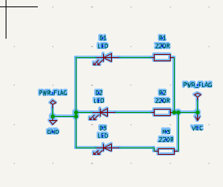
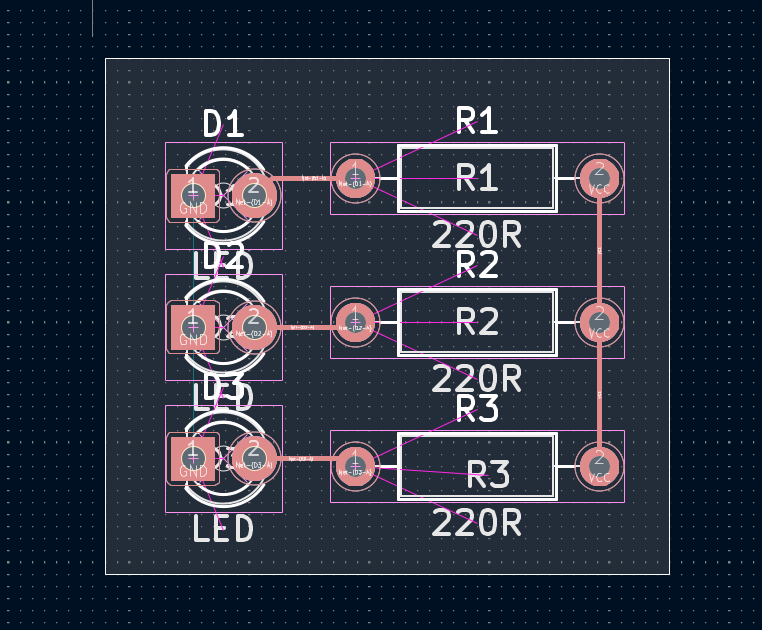

# Rapport journalier — 09 septembre 2026

## Atelier 1 — Conception de PCB avec KiCad

La première partie de la journée a été consacrée à la **poursuite des travaux de conception de circuits imprimés (PCB) avec KiCad**.

L'activité principale a porté sur la gestion des bibliothèques de composants et la création d'empreintes nécessaires à la conception des cartes électroniques.

Les travaux réalisés sont les suivants :

* Reprise des travaux précédemment effectués sur la conception de PCB avec **KiCad**.
* Découverte et pratique de l'**importation de bibliothèques de composants** dans KiCad.
* Recherche et intégration de bibliothèques nécessaires à la réalisation des schémas électroniques.
* Identification des composants dont les empreintes n'étaient pas disponibles dans les bibliothèques standards de KiCad.
* Création et personnalisation des **empreintes (footprints)** pour les composants non disponibles.
* Adaptation des dimensions et de la disposition des pastilles afin de correspondre aux caractéristiques physiques des composants réels.
* Vérification des empreintes créées avant leur utilisation dans la conception du PCB.

Cette séance a permis de mieux comprendre l'importance des bibliothèques dans un logiciel de conception électronique et la nécessité d'adapter les empreintes aux composants réellement utilisés lors de la fabrication d'une carte.

## Atelier 2 — Bases communes des langages de programmation

La deuxième partie de la journée a été consacrée à la poursuite de l'apprentissage de la **programmation**.

La séance a porté sur les **six éléments fondamentaux communs à la plupart des langages de programmation**, permettant de comprendre la structure générale d'un programme et les principes de base de la logique algorithmique.

L'objectif était de mieux comprendre les concepts fondamentaux nécessaires avant d'aborder des programmes plus complexes et différents langages de programmation.

## Conclusion

Cette journée a permis de renforcer les compétences en **conception électronique avec KiCad**, notamment dans la gestion des bibliothèques et la création d'empreintes personnalisées pour les composants ne disposant pas d'empreinte adaptée.

La séance consacrée à la programmation a également permis de consolider les **principes fondamentaux de la programmation**, qui constituent une base commune à différents langages.
