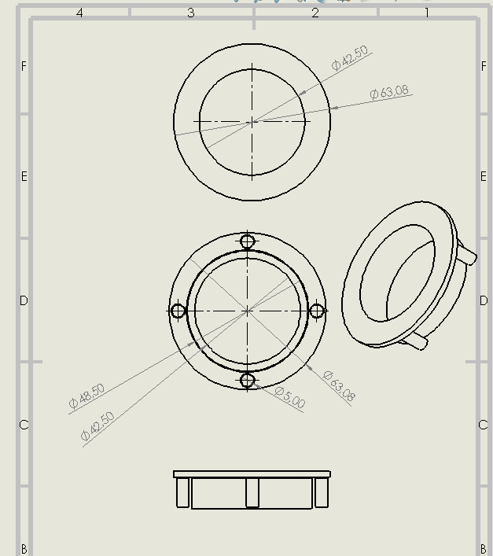
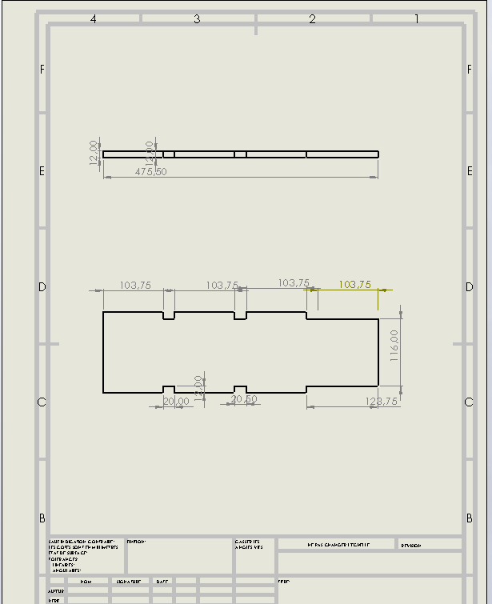
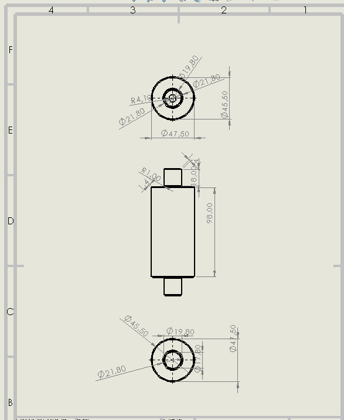

# Rapport journalier — 11 septembre 2026

## Atelier — Poursuite des travaux sur le projet

La journée a été consacrée à la poursuite des travaux de conception, de fabrication et d'assemblage du projet **P026 — Convoyeur à bande avec poste de marquage**.

Les principales activités réalisées sont les suivantes :

* **Impression 3D des tambours du convoyeur**, destinés à assurer le guidage et l'entraînement de la bande transporteuse.
.jpeg>) 
* Réalisation de l'**assemblage global du convoyeur dans SolidWorks** afin de vérifier l'intégration et le positionnement des différentes pièces.
* Mise en place d'une **animation de l'assemblage** dans SolidWorks afin de visualiser le fonctionnement et les mouvements des différents éléments du convoyeur.
.jpeg>)  
* Réalisation de la **mise en plan des différentes pièces** du projet dans SolidWorks.
* Préparation et exportation des plans au **format DXF**, destiné à la fabrication des pièces nécessitant une découpe.
* Importation des fichiers DXF dans le logiciel **xTool** pour préparer la fabrication.

* Début de la **découpe du châssis du convoyeur** à partir des fichiers préparés.

## Conclusion

Cette journée a permis de faire progresser le projet P026 de la **conception numérique vers la fabrication physique**. L'assemblage et l'animation dans SolidWorks ont permis de vérifier la cohérence de la conception, tandis que la mise en plan, l'exportation au format DXF et l'importation dans xTool ont permis d'entamer la fabrication du **châssis du convoyeur**.
